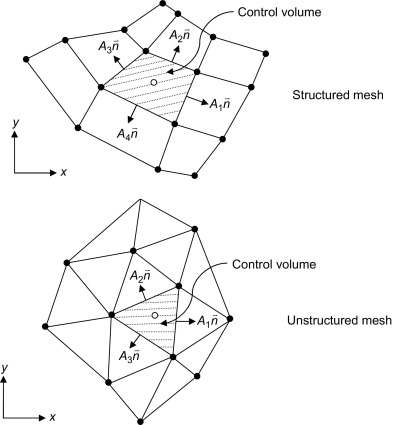
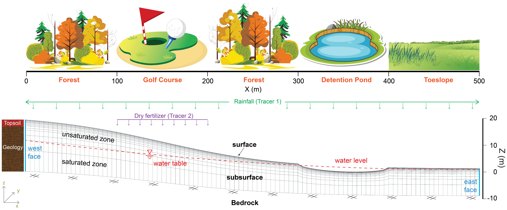

```{r xaringan-tile-view, echo=FALSE}
xaringanExtra::use_tile_view()
```

```{r xaringan-editable, echo=FALSE}
xaringanExtra::use_editable(expires = 1)
```

```{r xaringanExtra-search, echo=FALSE}
xaringanExtra::use_search(show_icon = TRUE)
```

```{r xaringan-scribble, echo=FALSE}
xaringanExtra::use_scribble()
```

```{r xaringan-panelset, echo=FALSE}
xaringanExtra::use_panelset()
```


# Setting up environment

- Clone the ats-short-course demos repository `r fontawesome::fa("github")`:
  ```{shell, eval=FALSE}
  $ git clone https://github.com/amanzi/ats-short-course; cd ats-short-course
  ```

- Download the `Docker` image and run the container `r fontawesome::fa("docker")`:
  ```{shell, eval=FALSE}
  $ docker pull metsi/ats-short-course:latest
  $ docker run -it -v $(pwd):/home/ats_sc_user/short-course:delegated -w /home/ats_sc_user/short-course -p 8899:8899 metsi/ats-short-course:latest
  ```

- Open `JupyterLab`:
  ```{shell, eval=FALSE}
  $ http://127.0.0.1:8899/lab
  ```

- Slides: [`ats-short-course/03_transport/slides/slides.html`](https://github.com/amanzi/ats-short-course/tree/ats-short-course-20250908/03_transport/slides/slides.html)
---

# Goals

<br>
<br>

- ### Understand the basics of the .content-box-purple[`transport PK`]
- ### Develop simple to advanced transport models with .content-box-yellow[`Amanzi-ATS`]

---

# How do we get there?

<br>
<br>

- ### Review transport modeling .brand-orange[(~10 min)]
- ### Learn how .content-box-green[`Amanzi-ATS`] simulates transport processes .brand-orange[(~10 min)]
- ### Build a surface-subsurface transport model step-by-step .brand-orange[(>60 min)]

---

# A model is a mapping from inputs to outputs
<!-- All models are wrong, but some are useful -->
<iframe 
  width="1200" 
  height="280" 
  src="imgs/model_diagram.html" 
  style="border:none; margin-top:-0px;">
</iframe>

<div style="
  position:absolute;
  top:100px;   /* distance from top of slide */
  left:50px;  /* distance from left of slide */
  width:200px;
  height:100px;
  background:white;
  z-index:2;">
</div>

--
.pull-left-31[
.font80[
- `ATS` is a .content-box-yellow[physics-based model]: `r fontawesome::fa("long-arrow-right")` .brand-blue[solves the governing equations of the processes]
$$
\mathcal{F}\left(D^{k} \mathbf{u}(s), D^{k-1} \mathbf{u}(s), \dots, D \mathbf{u}(s), \mathbf{u}(s), s\right) = 0
$$
- These equations are derived from .content-box-yellow[physical laws]: `r fontawesome::fa("long-arrow-right")` .brand-blue[high interpretability]
- Usually, these equations .content-box-yellow[have NO analytical solution]: `r fontawesome::fa("long-arrow-right")` .brand-blue[numerical solutions]
]]

.pull-right-13[
<iframe width="350" height="480" src="imgs/discretization.html", frameborder="0", display="block"></iframe>
]

---

# Advection-Dispersion Equation (ADE)
<br>

.content-box-grey[
.font120[  
$$
    \frac{\partial (\Theta C_i)}{\partial t} + \nabla \cdot(\mathbf{u} C_i) - \nabla \cdot (\Theta D^{*}_i \nabla C_i) + S_i = 0
$$
]]

.font90[
.pull-left-21[
- $\Theta$: mass of water per unit space <br>
  - $\Theta = \eta h \quad \text{for} \quad \partial \Omega \in \mathbb{R}^2$
  - $\Theta = \eta \phi S_w \quad \text{for} \quad \Omega \in \mathbb{R}^3$   
- $C_i$: mole fraction of the solute $i$ $\left( \frac{mol_{solute}}{mol_{H_2O}} \right)$ `r fontawesome::fa("long-arrow-right")` .brand-red[`unknowns`]
- $S_i$: source/sink terms of solute $i$ per unit space
- $D^{*}_i$: hydrodynamic dispersion coefficient of solute $i$ ($L^2/T$)
- $\mathbf{u}$: the flow velocity field ($L/T$) `r fontawesome::fa("long-arrow-left")` .content-box-green[`from the hydrology model`]
.font80[
$\eta$: water molar density ($M/L^{3}$); 
$\phi$: medium's porosity (-); 
$S_w$: degree of saturation (-); <br>
$h$: water depth on the surface ($L$)
]
]

.pull-right-12[


.footnote[```Molins et al. (2022)```]
]
]

---

# Numerical methods in `Amanzi-ATS` transport
<br>
.pull-left-64[
- `Amanzi-ATS` transport uses finite volume method (`FVM`) to obtain numerical solutions
- It solves the ADE by operator splitting into advection and diffusion stages:

$$
\begin{aligned}
\frac{\partial (\Theta C_i)}{\partial t} + \nabla \cdot (\mathbf{u}C_i) &= S_i \quad & (1) \\
\frac{\partial (\Theta C_i)}{\partial t} - \nabla \cdot \left(\Theta D_i^{*}\nabla C_i\right) &= 0 \quad & (2)
\end{aligned}
$$

  .font70[&nbsp; &nbsp; &nbsp; &nbsp; &nbsp; Eqn (1) is solved using an .content-box-green[explicit upwind (donor cell) scheme]] <br>
  .font70[&nbsp; &nbsp; &nbsp; &nbsp; &nbsp; Eqn (2) is solved using an .content-box-purple[implicit scheme]]
    
]

.pull-right-46[


.footnote[```Čanić et al. (2017)```]
]
---

# Transport problem

<br>



---

# Steps to Construct a Model in Amanzi-ATS
.pull-left[
.font80[
- **.brand-blue[Simulation domain]** `r fontawesome::fa("map")`
  - Where the processes happen

- .content-box-green[**.brand-blue[Process Kernel Tree]** `r fontawesome::fa("sitemap")`]
  - Which `PKs` to use and how they are coupled


- **.brand-blue[Model parameters]** `r fontawesome::fa("sliders")`
  - Physical and numerical properties

- **.brand-blue[Initial and boundary conditions]** `r fontawesome::fa("cogs")` `r fontawesome::fa("clock")`
  - State of the system at $t=t_0$
  - How system behaves at the boundaries at $t \ge t_0$

- **.brand-blue[Forcing, sources and sinks]** `r fontawesome::fa("cloud-sun-rain")`
  - External forces that drive changes in the system
  - .font90[Material or energy added/removed to/from the system]
]]

--

<br>

.pull-right[

**ATS `xml` top level list:**
.font70[
```r
MAIN

*- mesh: ["discretization of physical domains"]

*- regions: ["subsets of the computational domain"]

*- cycle driver: ["manages time and the execution of simulations"]

*- PKs: ["fundamental building blocks used to model processes"]

*- state: ["data manager that enables PKs to operate"]

- visualization: ["simulation data stored for graphical representation"]

- checkpoint: ["snapshots of the simulation state at specific points in time"]

- observations: ["localized-in-space but frequent-in-time view of simulation output"]
```
]]

.footnote[[ATS Documentation](https://amanzi.github.io/ats/stable/input_spec/main.html)]

---

class: small-panel-slide

# Process Kernel Tree
.font50[
**PK:** [`Process kernels`](https://amanzi.github.io/ats/stable/input_spec/process_kernels/index.html); **MPC:** [`Multi-process-couplers`](https://amanzi.github.io/ats/stable/input_spec/process_kernels/mpcs/index.html)
]
.panelset[
.panel[.panel-name[Hydrology]
.pull-left[
<iframe src="imgs/dependency_hydro.html" width="900" height="500" frameborder="0"></iframe>
]

.pull-right[
<br>
.font50[
```xml
<ParameterList name="Main">

* <ParameterList name="cycle driver">
*   <ParameterList name="PK tree">
      <ParameterList name="flow_coupler">
        <Parameter name="PK type" type="string" value="coupled water"/>
        <ParameterList name="subsurface flow">
          <Parameter name="PK type" type="string" value="richards flow"/>
        </ParameterList>
        <ParameterList name="surface flow">
          <Parameter name="PK type" type="string" value="overland flow, pressure basis"/>
        </ParameterList>
      </ParameterList>
    </ParameterList>
  </ParameterList>

* OTHER LISTS...

  <ParameterList name="PKs">
*   LIST OF PKS (i.e., flow coupler, subsurface flow, surface flow)
  </ParameterList>

</ParameterList>  
```
]]
]

.panel[.panel-name[Transport]
<iframe src="imgs/dependency_transport_incomplete.html" width="1200" height="650" frameborder="0"></iframe>
]]

---

class: small-panel-slide

# Transport Model Parameters

.content-box-grey[
$$
    \frac{\partial (\Theta C_i)}{\partial t} + \nabla \cdot(\mathbf{u} C_i) - \nabla \cdot (\Theta D^{*}_i \nabla C_i) + S_i = 0
$$
]

--
.panelset[
.panel[.panel-name[Physical]
.pull-left[
<br>  
.blockquote[Quantitative values representing the  properties or characteristics of a physical system]
]

.pull-right[
.small[
```xml
<ParameterList name="state" type="ParameterList">
  <ParameterList name="evaluators" type="ParameterList">
*   <ParameterList name="dispersion_coefficient" type="ParameterList">
      <Parameter name="evaluator type" type="string" value="dispersion tensor"/>
      <ParameterList name="mechanical dispersion parameters" type="ParameterList">
        <ParameterList name="domain" type="ParameterList">
*         <Parameter name="region" type="string" value="computational domain"/>
          <Parameter name="mechanical dispersion type" type="string" value="isotropic"/>
          <ParameterList name="isotropic parameters">
*           <Parameter name="alpha" type="double" value="#####"/>
          </ParameterList>
        </ParameterList>
      </ParameterList>
    </ParameterList>
  </ParameterList>
</ParameterList>  
```
]]]

.panel[.panel-name[Numerical]
.pull-left[
<br>  
.blockquote[
- Quantitative values that control the numerical solution of physics-based models
- Govern the accuracy, stability, and efficiency of the computational simulation]
]

.pull-right[
<br>  
.small[
```xml
<ParameterList name="surface transport">
  <Parameter name="PK type" type="string" value="transport ATS"/>
  <Parameter name="domain name" type="string" value="surface"/>
  <Parameter name="component names" type="Array(string)" value="{NAME1, ...}"/>
* <Parameter name="advection spatial discretization order" type="int" value="1"/>
* <Parameter name="temporal discretization order" type="int" value="1"/>
* <Parameter name="cfl" type="double" value="1.0"/>
  <Parameter name="water tolerance" type="double" value="0.001"/>
  ... 
</ParameterList>
```
]
]]]

---

# Forcings
.panelset[
.panel[.panel-name[Description]
- Uniform rainfall over the .content-box-purple[`surface domain`] region
- Rainfall rate: $r = 5.5 \times 10^{-7}$ $[m/s]$ (equivalent $1.98$ $[mm/h]$)
- Rainfall duration: from day 0 to day 10
- After day 10: $r = 0$ $[m/s]$
]

.panel[.panel-name[Plot]
```{r, fig.height=6, fig.width=12, fig.retina=2, fig.align='center', message=FALSE, warning=FALSE, echo=FALSE}
library(ggplot2)

# Define the time sequence and rainfall rates as a data frame
time <- seq(0, 30, by = 0.02)
rainfall_rate <- ifelse(time <= 10, 1.98, 0)
data <- data.frame(time = time, rainfall_rate = rainfall_rate)

ggplot(data, aes(x = time, y = rainfall_rate)) +
  geom_line(color = "blue", size = 2) +
  labs(
    title = "Rainfall inputs",
    x = "Time (day)",
    y = "Rainfall Rate (mm/h)"
  ) +
  scale_y_continuous(
    limits = c(0, 2.5),
    sec.axis = sec_axis(
      trans = ~ . * (0.001 / 3600),  # conversion mm/h → m/s
      name = "Rainfall Rate (m/s)"
    )
  ) +
  scale_x_continuous(breaks = seq(0, 30, by = 5), limits = c(0, 30)) +
  theme_minimal() +
  theme(
    plot.title = element_text(size = 32, face = "bold", hjust = 0.5),
    axis.title.x = element_text(size = 24),
    axis.title.y = element_text(size = 24),
    axis.title.y.right = element_text(size = 24),  # right y-axis label
    axis.text.x = element_text(size = 20),
    axis.text.y = element_text(size = 20),
    axis.text.y.right = element_text(size = 20)    # right y-axis ticks
  )
```
]

.panel[.panel-name[XML]
.pull-left[
Using function
.font70[
```xml
<ParameterList name="surface-water_source" type="ParameterList">
  <Parameter name="evaluator type" type="string" value="independent variable"/>
  <ParameterList name="function" type="ParameterList">
    <ParameterList name="domain" type="ParameterList">
      <Parameter name="region" type="string" value="surface domain"/>
      <Parameter name="component" type="string" value="cell"/>
      <ParameterList name="function" type="ParameterList">
        <ParameterList name="function-tabular" type="ParameterList">
*         <Parameter name="x values" type="Array(double)" value="{0, 864000}"/>
*         <Parameter name="y values" type="Array(double)" value="{5.5e-7, 0.0}"/>
*         <Parameter name="forms" type="Array(string)" value="{constant}"/>                
        </ParameterList>
      </ParameterList>
    </ParameterList>
  </ParameterList>
</ParameterList>
```
]]

.pull-right[
Loading from file
.font70[
```xml
<ParameterList name="surface-water_source" type="ParameterList">
  <Parameter name="evaluator type" type="string" value="independent variable" />
  <ParameterList name="function" type="ParameterList">
    <ParameterList name="domain" type="ParameterList">
      <Parameter name="region" type="string" value="surface domain" />
      <Parameter name="component" type="string" value="cell" />
      <ParameterList name="function" type="ParameterList">
        <ParameterList name="function-tabular" type="ParameterList">
*         <Parameter name="file" type="string" value="PATH/TO/FILENAME.h5" />
*         <Parameter name="x header" type="string" value="TIME" />
*         <Parameter name="y header" type="string" value="PRECIPITATION" />
        </ParameterList>
      </ParameterList>
    </ParameterList>
  </ParameterList>
</ParameterList>
```
]]

]
]
---

# Sources and sinks
.pull-left[
<br> <br>  

```{r, echo=FALSE}
library(knitr)
library(kableExtra)

# Create the data frame
df <- data.frame(
  `Name` = c("Region", "Type"),
  `Tracer1` = c("surface domain", "concentration"),
  `Tracer2` = c("golf course", "mass rate")
)

# Render the table bigger
kable(df, "html") %>%
  kable_styling(
    bootstrap_options = c("striped", "hover"),
    full_width = FALSE, 
    font_size = 20
  ) %>%
  row_spec(0, bold = TRUE, font_size = 24) %>%
  column_spec(1, width = "240px") %>%  # set first column width
  column_spec(2, width = "240px") %>%  # set second column width
  column_spec(3, width = "240px")      # third column

```

<br> <br> <br>
.font60[.content-box-purple[`volume`]: source is extensive quantity (molC/s) and evenly distributed across the region] <br>
.font60[.content-box-yellow[`none`]: source is intensive quantity (molC/m2/s) across the region]
]

.pull-right[
.font70[
```xml
<ParameterList name="surface transport">
  <ParameterList name="source terms">
    <ParameterList name="component mass source">

*     <ParameterList name="Source Rainfall">
        <Parameter name="component names" type="Array(string)" value="{Tracer1,Tracer2}"/>
        <Parameter name="regions" type="Array(string)" value="{surface domain}"/>
        <Parameter name="convert to field" type="bool" value="true"/>
        <Parameter name="spatial distribution method" type="string" value="field"/>
        <ParameterList name="field">
          <Parameter name="number of fields" type="int" value="2"/>
          <ParameterList name="field 1 info">
            <Parameter name="field key" type="string" value="surface-tracer1_injection_source"/>
            <Parameter name="component" type="string" value="cell"/>
          </ParameterList>
          <ParameterList name="field 2 info">
            <Parameter name="field key" type="string" value="surface-tracer2_zeros"/>
            <Parameter name="component" type="string" value="cell"/>
          </ParameterList>              
        </ParameterList>
      </ParameterList>

*     <ParameterList name="Tracer2 source">
        <Parameter name="component names" type="Array(string)" value="{Tracer2}"/>
        <Parameter name="regions" type="Array(string)" value="{golf course}"/>
        <Parameter name="spatial distribution method" type="string" value="none"/>
        <ParameterList name="source function">
          <ParameterList name="function-tabular">
            <Parameter name="x values" type="Array(double)" value="{x1, x2}"/>
            <Parameter name="y values" type="Array(double)" value="{y1, y2}"/>
            <Parameter name="forms" type="Array(string)" value="{constant}"/>
          </ParameterList>
        </ParameterList>
      </ParameterList>
    </ParameterList>

  </ParameterList>
</ParameterList>  
```
]]

---

# Initial and boundary conditions
.pull-left[
#### .blockquote[Initial conditions]
.small[
- located inside each PK in the `xml` file
- can be:
  - created from functions
  - loaded from files (e.g. checkpoints)
]

#### .blockquote[Boundary conditions]
.small[
- located inside each PK in the `xml` file
- if not specified, no-flux BCs are applied
]]

.pull-right[
<br>
.font70[
```xml
*<ParameterList name="PKs" type="ParameterList">

  <ParameterList name="surface transport">
*   <ParameterList name="initial condition">
      <Parameter name="constant" type="double" value="###"/>
    </ParameterList>
*   <ParameterList name="boundary conditions">
    </ParameterList>  
  </ParameterList>

  ...

  <ParameterList name="subsurface transport">
*   <ParameterList name="initial condition">
      <Parameter name="constant" type="double" value="###"/>
    </ParameterList>
  </ParameterList>

</ParameterList>  
```
]]

.footnote[`See the documentation for details about ICs and BCs:` [`https://amanzi.github.io/ats/stable/input_spec/common.html`](https://amanzi.github.io/ats/stable/input_spec/common.html)]
